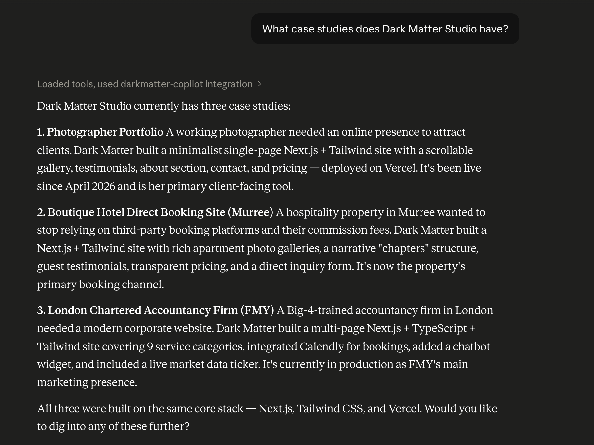
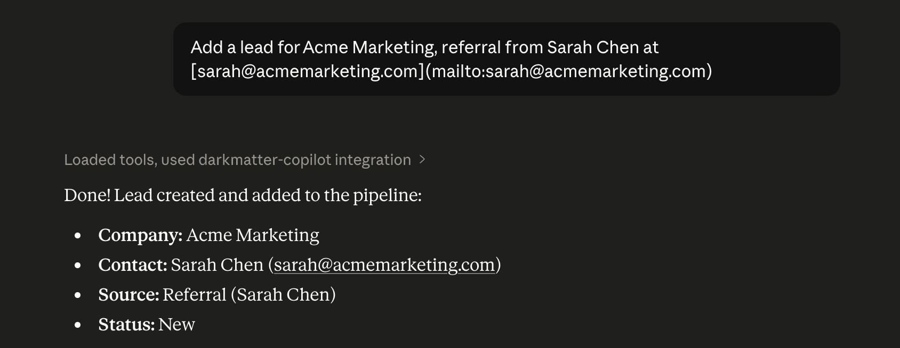
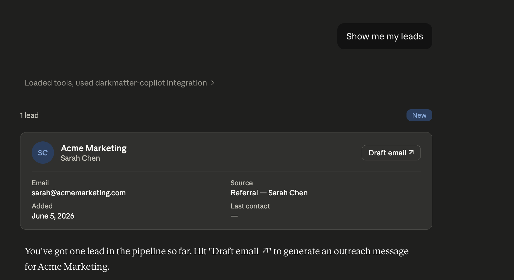
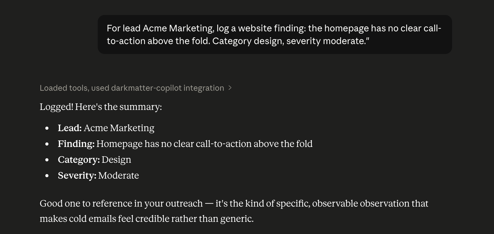
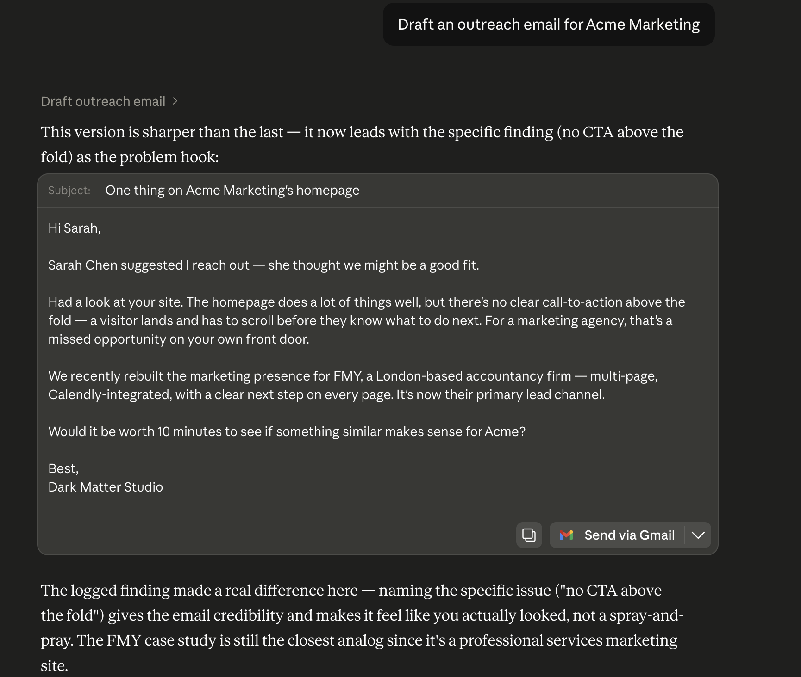
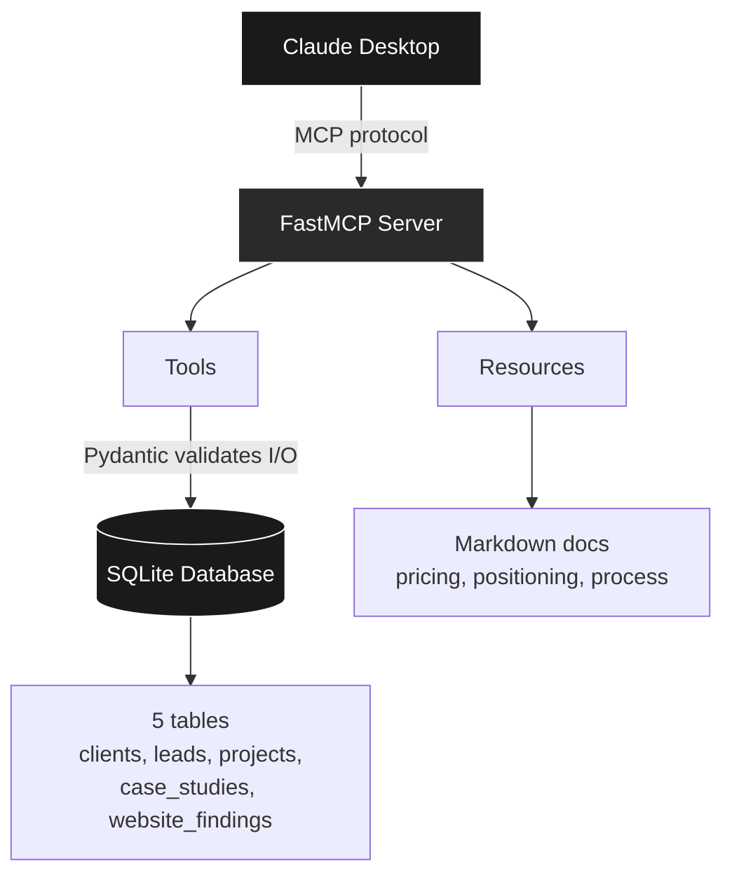

# Dark Matter Co-Pilot

An MCP server I built for my web studio. Connects Claude to the studio's real operations: case studies, leads, pricing docs, outreach drafting. The point is that Claude has real data to work from instead of guessing about a generic web agency.

Python, FastMCP, SQLite, Pydantic v2.

---

## What it does

After hooking it up to Claude Desktop, you can ask things like:

* "What case studies do I have?" — pulls them from the database.
* "Add a lead for Acme Corp, referral from John Smith." — logs the lead.
* "Show me leads I haven't contacted yet." — filters by status.
* "Mark lead 3 as won." — updates and bumps last_contact_at.
* "Draft a cold outreach email for lead 5." — fetches the lead, any prior notes on their website, all case studies, the studio's voice guide, and the outreach structure. Claude composes the email from there.

Data persists in a local SQLite database. Nothing is hallucinated. If Claude tells me my studio has done 12 projects, it's because the database actually has 12 projects.

---

## Why I built it

I run a small web studio out of Pakistan. I noticed I kept asking Claude for help drafting emails, pricing projects, deciding which past work to reference for a given lead. Claude was helpful but had no context about my actual studio. Every conversation started with me re-explaining what I do, what I've built, and what I charge.

This was annoying enough that I built the Co-Pilot. Now Claude knows.

---

## What it looks like

### Asking about past work



### Adding a lead and reading it back





### Adding a website finding



### Drafting a cold outreach email

The Co-Pilot pulls the lead, prior website findings, all case studies, the studio's voice guide, and the outreach structure. Claude composes the email from that context.



## Architecture



Pydantic models are the single source of truth. The same model that validates DB rows also defines what fields Claude sees when calling a tool, and how the response gets serialized back out. This avoids the usual mismatch you get when you have separate schemas for storage, API I/O, and validation.

A few patterns I leaned into:

* **Base/Create/Read split.** Each entity has three models. `Base` has the shared fields. `Create` is the input shape (no id, no auto-timestamps). `Read` is the output shape with everything including DB-assigned fields. Avoids the trap where Claude is asked to supply an id that the database is supposed to assign.
* **RFC 3339 timestamps.** SQLite's `CURRENT_TIMESTAMP` returns naive datetimes, but Claude Desktop strictly validates the JSON Schema `date-time` format, which requires a timezone. So every datetime field has a serializer that pins it to UTC. Took some debugging to figure out why my tools worked in the MCP Inspector but failed silently in Claude Desktop.
* **Transactions on writes only.** Reads use `with closing(get_connection())`. Writes wrap the work in `with conn:` so it's atomic.
* **Re-fetch after writes.** Instead of constructing the return value in Python after an INSERT, I re-SELECT the row and return that. Means defaults applied by SQLite (like `status = 'new'`) are reflected accurately.

---

## What's in the database

Five tables:

* `clients` — businesses I've worked with
* `leads` — prospects in the pipeline
* `projects` — the actual engagements, linked to clients
* `case_studies` — write-ups linked to projects, one per project
* `website_findings` — observations on lead websites, linked to leads

Foreign keys are enforced. CHECK constraints validate enum-like fields (status, source, project_type, severity). The `website_findings` table has an index on `lead_id` because that's the column it gets filtered by 99% of the time.

The schema and seed data live in `src/darkmatter_copilot/db.py` and `seed.py`. The seeded clients are real: Sussex Light Photography, The Crib Murree, FMY Chartered Accountants. All three are family referrals (which is a normal way for a new studio to start, no shame in it).

---

## Tools

10 tools split across modules:

| Tool | Purpose |
|------|---------|
| `hello_studio` | Sanity check that the MCP server is connected |
| `list_case_studies` | Returns all case studies with their problem/approach/result |
| `create_lead` | Adds a new lead with validation |
| `list_leads` | Returns leads, optionally filtered by status |
| `update_lead_status` | Moves a lead through the pipeline, bumps last_contact_at |
| `list_projects` | Returns projects with client name joined in |
| `list_clients` | Returns clients with a count of how many projects each has |
| `record_website_finding` | Logs an observation about a lead's website |
| `list_website_findings` | Returns findings, optionally filtered by lead |
| `draft_outreach_email` | Bundles lead + findings + case studies + voice + structure for Claude to compose an email |

## Resources

Three markdown documents Claude can read for context:

* `studio://pricing` — project ranges, scope drivers, add-ons
* `studio://positioning` — target clients, voice, differentiators
* `studio://process` — delivery process, post-launch checklist, scoping questions

---

## Setup

Needs Python 3.11+ and [uv](https://github.com/astral-sh/uv).

```bash
git clone https://github.com/saad-aamir/darkmatter-copilot.git
cd darkmatter-copilot
uv sync
uv run python -m darkmatter_copilot.seed
```

Test with the MCP Inspector:

```bash
uv run mcp dev src/darkmatter_copilot/server.py
```

### Hooking it up to Claude Desktop

Edit your Claude Desktop config:

* macOS: `~/Library/Application Support/Claude/claude_desktop_config.json`
* Windows: `%APPDATA%\Claude\claude_desktop_config.json`

```json
{
  "mcpServers": {
    "darkmatter-copilot": {
      "command": "uv",
      "args": [
        "--directory", "/absolute/path/to/darkmatter-copilot",
        "run", "python", "src/darkmatter_copilot/server.py"
      ]
    }
  }
}
```

Restart Claude Desktop. The tools should show up in your chats.

---

## What I left out

* No frontend dashboard. The MCP client (Claude Desktop) is the interface. Building a separate web UI would just duplicate what Claude already does.
* No authentication, no multi-user. It's a personal tool.
* No `generate_proposal` for warm leads yet. The architecture is the same as `draft_outreach_email` so it's not hard to add. I'll build it when I have warm leads to test against.
* No external CRM integration. All data lives locally in SQLite.

---

## A note on how this was built

I used Claude (specifically, Claude in a long chat conversation) as a pair programmer throughout. I owned the architecture, the schema design, and most of the design tradeoffs. Claude helped me move quickly through implementation, debug issues, and think through patterns I hadn't worked with before (Pydantic v2, MCP protocol internals).

I don't think this needs to be hidden. Most engineering in 2026 is going to look like this.

---

## License

MIT. See [LICENSE](LICENSE).
